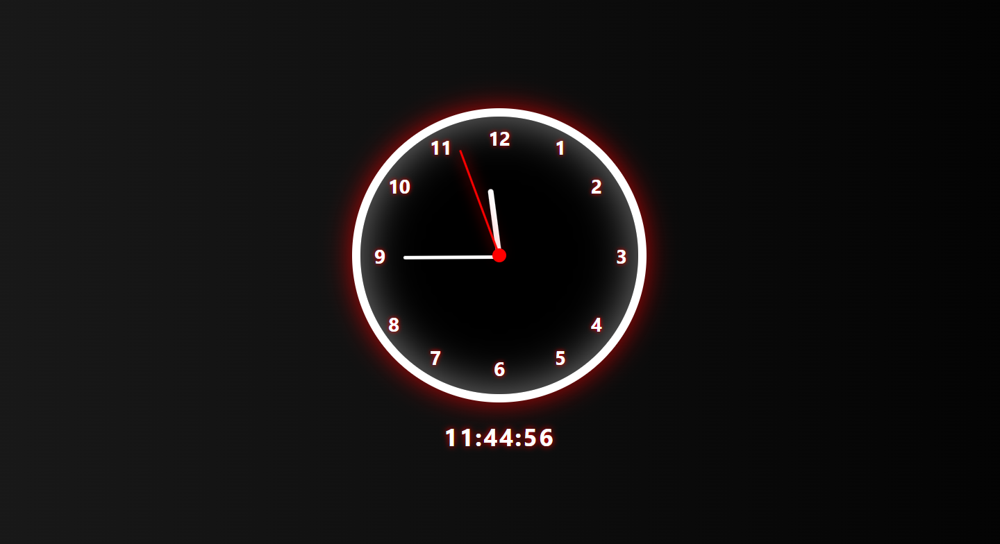

# ⏰ JS Clock Project

An interactive analog + digital clock built using **HTML, CSS, and JavaScript**.

## Features
- Black round clock with smooth red/white pointers
- Shows the **current local time** (analog + digital)
- Real-time updates using JavaScript
- Simple, clean, and responsive design

## How to Run
1. Clone or download this repository.
2. Open `index.html` in any modern web browser.

## Live Demo

